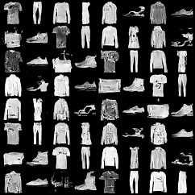
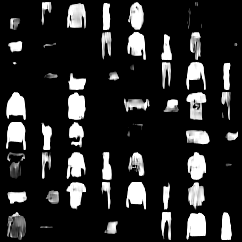
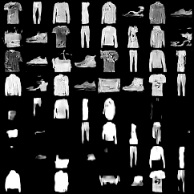

# GRPO JPEG Compression Experiment

This experiment tests whether NanoFlow's Flow-GRPO implementation can optimize a cheap, verifiable image-generation reward: lower JPEG bits-per-pixel on low-resolution Fashion-MNIST samples.

## Summary

The JPEG reward is learnable: a 300-epoch moderate-long GRPO run reduced JPEG bpp by about **20.3%** on a fixed 64-sample comparison.

The tradeoff is visible and measurable: the fine-tuned images are much smoother and contain less local detail, which makes them easier to compress, but classifier accuracy and sample diversity degrade.

## Reward

The reward is terminal and non-differentiable:

```text
reward(x) = -jpeg_bits_per_pixel(x)
jpeg_bits_per_pixel = 8 * jpeg_file_bytes / (H * W)
```

Fashion-MNIST samples are encoded as grayscale JPEG (`PIL` mode `L`) with fixed settings:

```yaml
quality: 75
optimize: false
progressive: false
subsampling: null
```

No straight-through estimator or differentiable JPEG approximation is used. GRPO only needs black-box terminal rewards.

## Config files

Relevant repo configs:

- `configs/experiment/fashion_grpo_jpeg.yaml`
- `configs/reward/fashion_jpeg_compressibility.yaml`
- `configs/rl_training/jpeg_compressibility.yaml`
- `configs/metrics/jpeg_compressibility.yaml`

## Moderate-long run command

Run from repo root:

```bash
uv run python train_grpo.py \
  experiment=fashion_grpo_jpeg \
  device=mps \
  rl_training.epochs=300 \
  rl_training.batch_size=4 \
  rl_training.G=8 \
  rl_training.num_inner=6 \
  rl_training.lr=2.0e-5 \
  rl_training.clip_eps=0.5 \
  rl_training.kl_beta=0.01 \
  rl_training.advantage_scale=5.0 \
  rl_training.save_every=100 \
  rl_training.run_prefix=fashion_grpo_jpeg_moderate_long
```

Recorded run directory:

```text
runs/fashion_grpo_jpeg_moderate_long_20260516_213332
```

## Evaluation / metrics override

The training command above sets the **GRPO reward** to JPEG compressibility via `experiment=fashion_grpo_jpeg`. Inference metrics are separate: the top-level `configs/config.yaml` defaults to `metrics: none`, so JPEG/PNG bpp metrics are enabled by explicitly passing the metrics override:

```bash
uv run python inference.py \
  experiment=fashion_cfg \
  metrics=jpeg_compressibility \
  inference.sampler.checkpoint=runs/fashion_grpo_jpeg_moderate_long_20260516_213332/checkpoints/latest.pt \
  inference.n_samples=64 \
  inference.save_path=runs/fashion_grpo_jpeg_moderate_long_20260516_213332/eval_compare/inference_grid.png \
  device=mps
```

Relevant code/config pointers:

- Training reward config: `configs/experiment/fashion_grpo_jpeg.yaml` overrides `/reward: fashion_jpeg_compressibility`.
- Reward implementation: `rl.reward.JpegCompressibilityReward`, using helpers in `rl/compression.py`.
- Metric config: `configs/metrics/jpeg_compressibility.yaml`.
- Metric implementation: `metrics.JpegCompressibilityMetric`.
- Metric instantiation: `inference.py` reads `cfg.inference.metrics` and instantiates each metric with Hydra.

Note: the fixed-grid comparison below was produced by a small evaluation script that instantiated `JpegCompressibilityMetric` directly, but the equivalent standalone inference path is the `metrics=jpeg_compressibility` override above.

## Visual comparison

The following grids use the same fixed labels/random seed. The fine-tuned samples are visibly smoother, with less texture/detail than the seed samples. This is consistent with the compression objective: JPEG can encode smoother images with fewer bits.

### Seed model



### GRPO JPEG fine-tuned model



### Side-by-side grid

Top rows are seed-model samples; bottom rows are fine-tuned samples.



## Results

Fixed 64-sample comparison:

| Model | JPEG bpp ↓ | PNG bpp ↓ | Total variation ↓ | High-freq energy ↓ | Duplicate fraction ↓ | Classifier acc ↑ |
|---|---:|---:|---:|---:|---:|---:|
| Seed | 6.2736 | 5.3020 | 0.3292 | 0.2269 | 0.0000 | 0.9531 |
| GRPO JPEG moderate-long 300 | 4.9990 | 2.6207 | 0.1556 | 0.1678 | 0.1563 | 0.6094 |

JPEG bpp reduction:

```text
6.2736 -> 4.9990
absolute reduction = 1.2746 bpp
relative reduction ≈ 20.3%
```

PNG bpp also drops substantially:

```text
5.3020 -> 2.6207
relative reduction ≈ 50.6%
```

## Interpretation

The experiment demonstrates that JPEG compressibility is a viable verifiable reward for Flow-GRPO:

- JPEG bpp drops by about **20.3%**.
- PNG bpp drops by about **50.6%**.
- Total variation drops from `0.3292` to `0.1556`, indicating much smoother generated images.
- High-frequency energy also drops, matching the visual reduction in fine detail.

However, the result is not distribution-preserving enough yet:

- Fashion classifier accuracy drops from `95.31%` to `60.94%`.
- Duplicate fraction rises from `0.0` to `15.63%`.
- The fine-tuned grid visibly loses detail and variety.

Conclusion: the reward works as an optimization target, but the current pure-compressibility setup over-optimizes smoothness. The next version should preserve quality with stronger KL, lower advantage scaling, early stopping, or a composite reward.

## Earlier reference runs

### Conservative 30-epoch run

Hyperparameters:

```yaml
epochs: 30
batch_size: 4
G: 8
num_inner: 4
lr: 1.0e-5
clip_eps: 0.2
kl_beta: 0.04
advantage_scale: 1.0
```

Fixed 64-sample comparison:

| Model | JPEG bpp ↓ | Classifier acc ↑ |
|---|---:|---:|
| Seed | 6.2736 | 0.9531 |
| Conservative 30 | 6.1787 | 0.9531 |

This was only a ~1.5% JPEG bpp reduction and likely too weak/noisy.

### Aggressive 100-epoch run

Hyperparameters:

```yaml
epochs: 100
batch_size: 4
G: 8
num_inner: 8
lr: 5.0e-5
clip_eps: 1.0
kl_beta: 0.001
advantage_scale: 10.0
```

Fixed 64-sample comparison:

| Model | JPEG bpp ↓ | PNG bpp ↓ | Duplicate fraction ↓ | Classifier acc ↑ |
|---|---:|---:|---:|---:|
| Seed | 6.2736 | 5.3020 | 0.0000 | 0.9531 |
| Aggressive 100 | 5.1805 | 2.3787 | 0.0781 | 0.5938 |

This achieved ~17.4% JPEG bpp reduction but degraded classifier accuracy. It confirmed reward optimization but not quality preservation.

## Next run ideas

To preserve quality better while improving compressibility, try one or more of:

- Increase KL relative to moderate-long, e.g. `kl_beta=0.02` or `0.04`.
- Lower `advantage_scale`, e.g. `2.0` or `3.0`.
- Keep a longer runtime but reduce LR, e.g. `1.0e-5` to `1.5e-5`.
- Add early stopping based on a quality guardrail, e.g. stop when Fashion classifier accuracy drops below a threshold.
- Try a composite reward after pure reward behavior is characterized:

```text
reward = -jpeg_bpp + alpha * classifier_log_prob(prompt | image)
```
